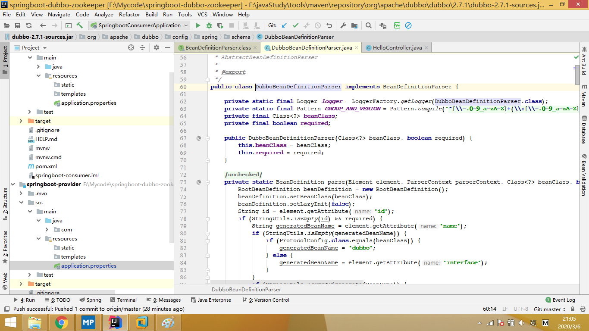
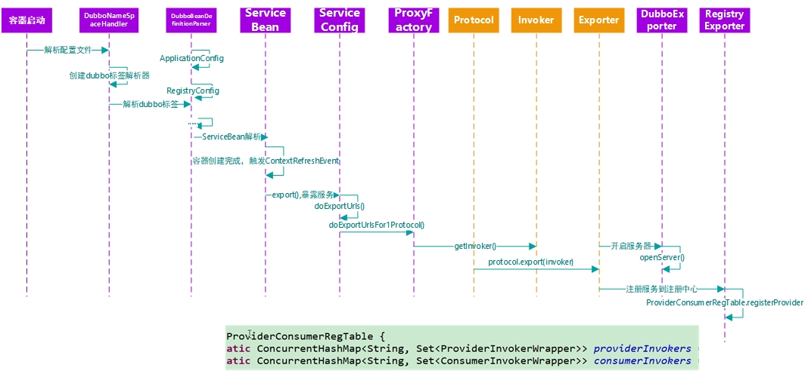
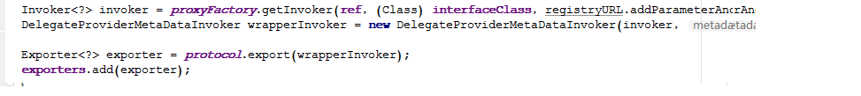
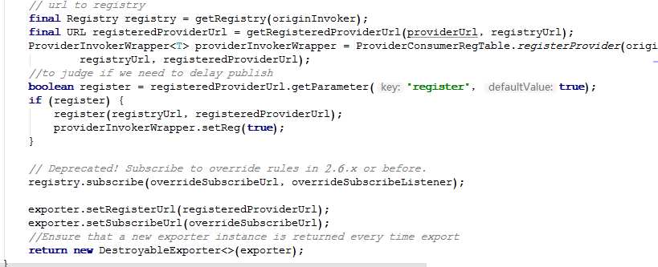

#### Dubbo笔记
[官网文档](http://dubbo.apache.org/zh-cn/docs/user/quick-start.html)
### 标签注册流程
dubbo在启动后会解析配置文件（或注解），解析器一律实现了BeanDefinitionParser接口，dubbo标签的解析使用，DubboBeanDeefinitionParser类的parser方法

1. 运行后先执行DubboBeanDefinitionParser.parse，主要目的为解析标签内属性

2. 存在一个DubboNameSpaceHandler，在RegisterBeanDefinitionPaser实例中注册了相应的DubboBeanDefinitionParser,将相应的Config，bean放入对应的解析器parser中
` registerBeanDefinitionParser("protocol", new DubboBeanDefinitionParser(ProtocolConfig.class, true));`
3. 而在DubboBeanDefinitionParser.parser中，其主要行为为判断传入的beanClass是否为相应的XxxConfig，并将parserContext中的标签信息传入对应的Config，Bean
      `if (ProtocolConfig.class.equals(beanClass)) {
            for (String name : parserContext.getRegistry().getBeanDefinitionNames()) {
                BeanDefinition definition = parserContext.getRegistry().getBeanDefinition(name);
                PropertyValue property = definition.getPropertyValues().getPropertyValue("protocol");
                if (property != null) {
                    Object value = property.getValue();
                    if (value instanceof ProtocolConfig && id.equals(((ProtocolConfig) value).getName())) {
                        definition.getPropertyValues().addPropertyValue("protocol", new RuntimeBeanReference(id));
                    }
                }
            }`
  
   
### 服务暴露流程

1. DubboBeanDefinitionParser.parse在解析ServiceBean标签。ServiceBean实现了InitializingBean，ApplicationListener<ContextRefreshedEvent>接口，他们分别会调用afterPropertiesSet()(在属性设置完成后)，onApplicationEvent(E event)(容器刷新完成之后)方法。
2. afterPropertiesSet()，在获取provider组件为空后（刚启动一定为空），调用setProvider（），将对应的provider的配置信息（也就是标签信息），保存在ServiceBean之中。
3. onApplicationEvent(E event)，判断必须是在设定为暴露且尚未暴露且非延时暴露的情况下，调用export()。暴露服务
4. export()->(检查判断)doExport()->doExportUrls()(加载注册中心信息)->（按设定的暴露协议遍历）doExportUrlsForProtocol()->添加属性,从代理工厂获得执行器invoker（内部是对应的serviceImpl，url等对象）->protocol.export()->保存对应的exporter到ServiceConfig

protocol的来历：以dubbo的spi机制，获得的DubboProtocol与RegistryProtocol
`private static final Protocol protocol = ExtensionLoader.getExtensionLoader(Protocol.class).getAdaptiveExtension();`
5. RegisterProtocol.export(originInvoker)。先doLocalExport(originInvoker)​,再将执行者（originInvoker）、注册中心地址（registerUrl）、服务提供者地址（registerProviderUrl）注册到服务提供者消费者注册表（ProviderConsumerRegTable）的providerInvokers中。
 - doLocalExport(originInvoker)，先实例化一个expoter（暴露器），然后进入DubboProtocol的export（）
6. DubboProtocol.protocol(invoker)。先获得执行者的url，将invoker，url，expoterMap信息封装到一个DubboExpoter对象中，在openServer()，打开服务器。
7. openServer()->从serverMap获得一个ExchangeServer，没有则createServer(url)->Exchange.bind(url,requestHandler)->Transporters.bind(url,decodehandler)->new NettyServer(url,listener)。最终创建一个netty服务器，监听protocol设置的端口。返回给RegistryProtocol。
8. 服务器启动后，注册服务提供者。ProviderConsumerRegTable中保存着providerInvokers和consumerInvokers的conCurrentHashMap，将传入的服务提供者信息封装为一个ProviderInvokerWrapper，再以传入的invoker为key，以ProviderInvokerWrapper为值作为一个invokers的键值对，放入providerInvokers中，以url为key，以invokers为值。返回ProviderInvokerWrapper
9. RegistryProtocol中之后判断是否需要延迟注册到注册中心中,之后调用zookeeper客户端将服务注册到zookeeper中。
10. 总结：DubboProtocol启动netty服务器，监听服务端口，RegistryProtocol将服务注册到注册中心。

### 服务引用过程

1. 其主要为ReferenceBean作用，因为它实现了spring的FactoryBean接口，当提供者自动注入service时，会调用ReferenceBean.getObject(),之后会在ReferenceConfig中调用get()，在方法中调用init()，在其中会ref=createProxy(map),map中是创建代理对象使用的信息（如：注册地址、代理方法、接口、版本号等等），在创建代理对象中，invoker = refprotocol.refer(interfaceClass, urls.get(0))。
2. refprotocol依旧是按照配置调用，先进入RegistryProtocol，调用refer方法，获取注册中心信息，调用doRefer(getMergeableCluster(), registry, type, url)->directory.subscribe()订阅服务
3. 订阅时会进入DubboProtocol.refer()。DubboInvoker<T> invoker = new DubboInvoker<T>(serviceType, url, getClients(url), invokers);
4. getCilet(url)。根据连接数创建客户端->initCilent(url)->Exchanges.connect(url,requestHandler)->Transporter.connect(url,handler)->new NettyCilent(url,listener),最终创建一个netty客户端
5. DubboProtocol.refer()返回一个invoker，订阅完成后，RegistryProtocol获得一个invoker。之后再将invoker、url、subscribeUrl、directory注册在服务提供者消费者注册表（ProviderConsumerRegTable）的consumerInvokers中。
6. 所有方法返回，ref=createProxy(map)创建代理对象完成，注入service中，服务引用完成
7. 总结：服务引用即在spring自动注入时，使用DubboProtocol创建netty客户端连接服务提供者，RegistryProtocol将客户端信息，invoker信息等注册到注册表中。返回一个代理对象，供spring调用。

### 服务调用流程
1. 在调用引用的代理对象时，将会调用invoke(),其中将需要调用的方法等信息封装（new RpcInvocation(method, args)），之后invoker.invoke()
2. 先进入MockClusterInvoker的invoke(invocation)->服务容错FailXxxinvoker.invoke()
3. 在容错Invoker中，从注册中心获得所有对应的invoker（有不同版本号的），获得负载均衡机制信息，继续doInvoke()
4. 根据配置选择需要的invoker（内部有filter,比如cache、mock功能），继续invoke()
5. 进入层层filter，不停invoke()，来到DubboInvoker，执行doInvoke(),获得currentCilent，执行currentCilent.request(inv,timeout).get(),进入netty，h获得channel，模拟请求，channel.send(req)
6. 请求发出后，等待服务提供者返回，在设定超时时限内若返回（还有重试），则代理对象的get()触发，获得返回信息，封装结果对象，调用完成